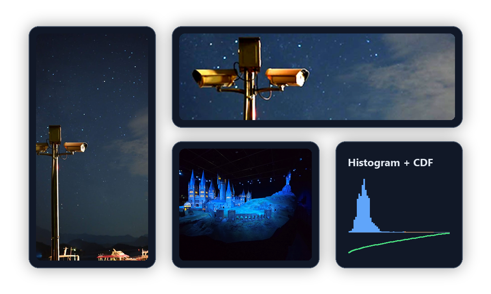

# Manual Histogram Equalization

Coursework project for Image Processing.

This project implements histogram equalization from first principles for grayscale and RGB images. It includes manual RGB-to-grayscale conversion, 256-bin histogram computation, CDF-based equalization, independent RGB channel equalization, and brightness-preserving equalization.

## Preview



## Coursework Note

Built as an academic project to practice implementing image enhancement algorithms from first principles and documenting visual results clearly.

## Features

- Manual grayscale conversion using luminance weights
- Manual 256-bin histogram calculation
- CDF-based intensity remapping
- RGB channel-wise equalization
- Brightness-based equalization that preserves color ratio
- Montage and histogram plot generation for comparison

## Tech Stack

- Python
- NumPy
- Pillow
- Matplotlib

## Run

```bash
pip install -r requirements.txt
python histogram_equalization_report.py
```

Input images are included as `img1.png`, `img2.png`, and `img3.png`.

## Included Materials

- Source implementation: `histogram_equalization_report.py`
- Input images: `img1.png`, `img2.png`, `img3.png`
- Original report: `report.pdf`
- Generated outputs are written to `outputs/` when the script is run.
